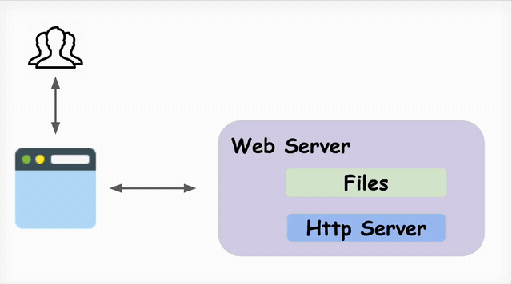
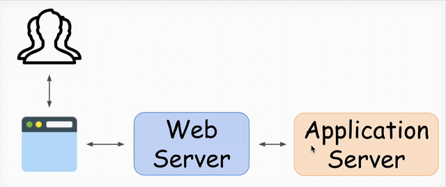
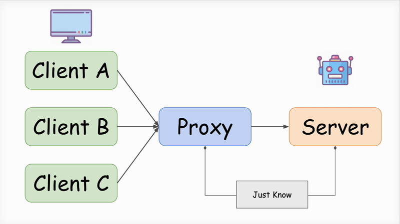
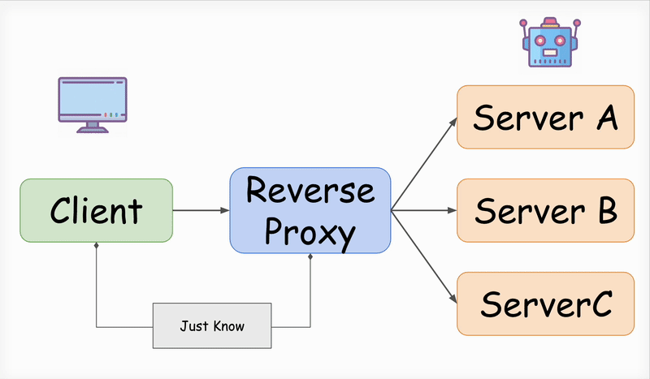
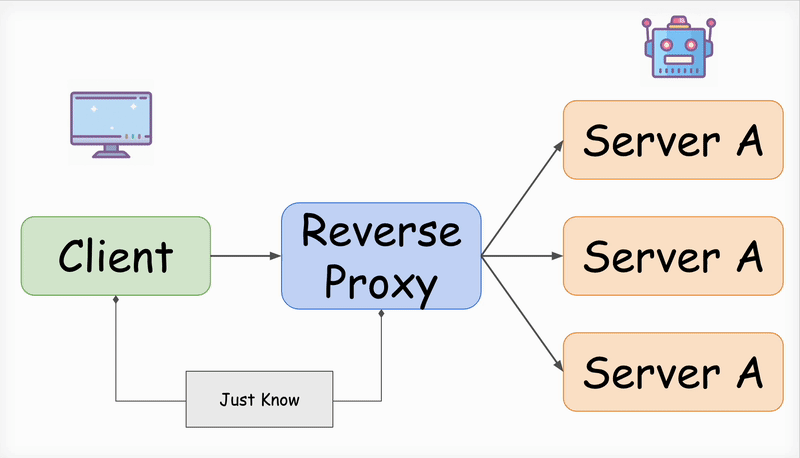

::: block
***Nginx Introduction*** {style=background:red;width:500px}
::: 

---

## Outline
<style>
ol li{margin-bottom:10px;}
</style>

<ol>
  <li>What is a Web Server ?</li>
  <li>What is a Nginx ? </li>
  <li>Nginx Advantages </li>
  <li>Reverse Proxy Demo </li>
  <li>Load Balance Demo </li>
</ol>

---

## What is a Web Server ?

<h3>
簡單來說，就是提供 Web 相關服務的伺服器
</h3>

--

### Hardware

<dl>
  <!-- <dt>Hardware</dt> -->
  <dd>
    指的是保存有伺服器軟體和網頁相關檔案的實體電腦，透過 web server 將會連接到網際網路，並且與其他網路上的裝置進行物理上的資料交換。
  </dd>
</dl>

--

### Software

<dl>
  <dd>包含了一連串控制網路用戶如何訪問託管檔，至少有HTTP伺服器。
  HTTP伺服器是其中一個部份，它理解 URLs 與 HTTP 瀏覽器用來觀察網頁的協議。它能透過域名訪問託管的網站 並將其內容遞送到終端用戶的設備上。
  </dd>
</dl>

--

### 簡單來說...

<div>
    Ｗeb server是控制使用者可以存取到哪些檔案，HTTP server 就是在處理 request 和 response 之間的關係。
</div>



--

### 實際上...

<ol>
    <li style>
        Web Server：只能拿來處理靜態資源，負載平衡、代理，而所謂動態資源是指把需求轉發到程式語言起的 Application Server，由Application Server處理完後，再丟 response 回去，由 Web Server 進行回應，最後才回到 Client 端。
    </li>
    <li>
        Application Server：就是可以用程式語言建立出的 Server，且可以靜態跟動態解析。
    </li>
<ol>

--

### 




--

### Popular web Server

<style>
.flex-container {
  display: flex;
  justify-content: center;
  /* background-color: DodgerBlue; */
}

</style>

<ol>
  <li>Apache</li>
  <li>Nginx</li>
  <li>Windows IIS</li>
</ol>

<div class="flex-container" >
    <div>  </div>
    <div>  </div>
    <div>  </div>
</div>

--

## WebSite with Apache 

<div class="flex-container"> 
    <span>
        LAMP = Linux + <strong>Apache</strong> + MySQL +PHP
    </span> 
    <div style="margin: 0"> 
        
    </div>
</div>

<div  class="flex-container"> 
    <span>WAMP = Windows +  <strong>Apache</strong> + MySQL +PHP</span>
    <div style="margin: 0 10px;">    </div>
</div>

<div class="flex-container"> 
    <span>XAMPP =  <strong>Apache</strong> + MariaDB + Perl +PHP</span> 
    <div style="margin: 0 10px;">   </div>
</div>


---

## What is a Nginx?
<h4>NGINX是用於 Web 服務、反向代理、緩存、負載平衡、媒體流等的開源軟件。</h4>

--

### Function

<div>
 最初是為實現最高性能和穩定性而設計的Web服務器，包含以下功能：
<ol>
  <li>HTTP Server</li>
  <li>Proxy server for email (IMAP, POP3, and SMTP) </li>
  <li><strong>Reverse proxy</strong> and <strong>Load balancer</strong> for HTTP, TCP, and UDP servers</li>
</ol>

note: 除了 HTTP 服務器功能之外，NGINX 還可以用作電子郵件（IMAP、POP3 和 SMTP）的代理服務器以及 HTTP、TCP 和 UDP 服務器的反向代理和負載平衡器。
</div> 

--

### What is a Prxoy ?



--

### What is a Reverse Proxy?



--

### Summary

<h3 style="margin-bottom:16px;">
    Proxy 隐藏真實 Client
</h3>

<h3 style="margin-top:16px;">
    Reverse Proxy 隱藏真實 Server
</h3>

--

### What is a Load Balance ?




---

### Nginx Advantages

<ol>
    <li>
    Uses Non-blocking, Event-driven architecture that requires less CPU and memory.
    </li>
    <li>
    Optimize and serve static content, so serving the static content 2.5 times faster than Apache and consumes less memory.
    </li>
    <li>
    Simple configuration.
    </li>
</ol>

---


### Load Balance - Dockerfile

```
FROM node

RUN mkdir /src

WORKDIR /src

ADD ./src /src

RUN npm install

CMD ["npm", "run", "start"]
```

--

### Load Balance - docker-compose.yml
```
version: '3'
services:
  nginx:
    image: nginx
    volumes:
        - ./default.conf:/etc/nginx/conf.d/default.conf
    depends_on:
      - website1
      - website2
      - website3
    ports:
      - 8888:80
  website1:
    build: ./
    container_name: website1
    environment:
      PORT: 2008
    ports:
      - 2008:2008

  website2:
    build: ./
    container_name: website2
    environment:
      - PORT=3008
    ports:
      - 3008:3008

  website3:
    build: ./
    container_name: website3
    environment:
      - PORT=5008
    ports:
      - 5008:5008
```

--

### Load Balance - default.conf
```
upstream node_cluster {
  server website1:2008; # 要對應查詢的結果
  server website2:3008; # 要對應查詢的結果
  server website3:5008; # 要對應查詢的結果
}
server {
  listen 80;
  location / {
    proxy_pass http://node_cluster/; # 代理
  }
}
```

---

# vscode-reveal

 Awesome VS code extension using The HTML Presentation Framework Revealjs

<small>Created by [Vincent B.](https://www.evilznet.com) / [@Evilznet](https://twitter.com/Evilznet)</small>

---

## Hello There

reveal.js enables you to create beautiful interactive slide decks using HTML. This presentation will show you examples of what it can do.

---

## Vertical Slides

Slides can be nested inside of each other.

Use the _Space_ key to navigate through all slides.

<a href="#" class="navigate-down">
    
</a>

--

## Basement Level 1

Nested slides are useful for adding additional detail underneath a high level horizontal slide.

--

## Basement Level 2

That's it, time to go back up.

<a href="#/2">
    
</a>

---

## Point of View

Press **ESC** to enter the slide overview.

Hold down alt and click on any element to zoom in on it using [zoom.js](http://lab.hakim.se/zoom-js). Alt + click anywhere to zoom back out.

> Use ctrl + click in Linux

---

## Touch Optimized

Presentations look great on touch devices, like mobile phones and tablets. Simply swipe through your slides.

---

## Markdown support

```
  ## Markdown support

  Write content using inline or external Markdown.
  Instructions and more info available in the 
  [readme](https://github.com/hakimel/reveal.js#markdown).
```

---

## Fragments

Hit the next arrow...

... to step through ...
<span class="fragment">... a</span> <span class="fragment">fragmented</span> <span class="fragment">slide.</span>

Note:
This slide has fragments which are also stepped through in the notes window.

--

## Fragment Styles

There's different types of fragments, like:

grow {.fragment .grow}

shrink {.fragment .shrink}

fade-out {.fragment .fade-out}

fade-right{.fragment .fade-right}

fade-up{.fragment .fade-up}

fade-down{.fragment .fade-down}

fade-left{.fragment .fade-left}

--

## Fragment Styles

fade-in-then-out{.fragment .fade-in-then-out}

fade-in-then-semi-out {.fragment .fade-in-then-semi-out"}

current-visible {.fragment .current-visible}

Highlight **red**{.fragment .highlight-red} **blue**{.fragment .highlight-blue} **green**{.fragment .highlight-green}

---

## Transition Styles

You can select from different transitions, like:
[None](?transition=none#/transitions) - [Fade](?transition=fade#/transitions) - [Slide](?transition=slide#/transitions) - [Convex](?transition=convex#/transitions) - [Concave](?transition=concave#/transitions) - [Zoom](?transition=zoom#/transitions)

---

## Themes

reveal.js comes with a few themes built in:
<a href="#" onclick="document.getElementById('theme').setAttribute('href','libs/reveal.js/3.8.0/css/theme/black.css'); return false;">Black (default)</a> -
<a href="#" onclick="document.getElementById('theme').setAttribute('href','libs/reveal.js/3.8.0/css/theme/white.css'); return false;">White</a> -
<a href="#" onclick="document.getElementById('theme').setAttribute('href','libs/reveal.js/3.8.0/css/theme/league.css'); return false;">League</a> -
<a href="#" onclick="document.getElementById('theme').setAttribute('href','libs/reveal.js/3.8.0/css/theme/sky.css'); return false;">Sky</a> -
<a href="#" onclick="document.getElementById('theme').setAttribute('href','libs/reveal.js/3.8.0/css/theme/beige.css'); return false;">Beige</a> -
<a href="#" onclick="document.getElementById('theme').setAttribute('href','libs/reveal.js/3.8.0/css/theme/simple.css'); return false;">Simple</a> <br>
<a href="#" onclick="document.getElementById('theme').setAttribute('href','libs/reveal.js/3.8.0/css/theme/serif.css'); return false;">Serif</a> -
<a href="#" onclick="document.getElementById('theme').setAttribute('href','libs/reveal.js/3.8.0/css/theme/blood.css'); return false;">Blood</a> -
<a href="#" onclick="document.getElementById('theme').setAttribute('href','libs/reveal.js/3.8.0/css/theme/night.css'); return false;">Night</a> -
<a href="#" onclick="document.getElementById('theme').setAttribute('href','libs/reveal.js/3.8.0/css/theme/moon.css'); return false;">Moon</a> -
<a href="#" onclick="document.getElementById('theme').setAttribute('href','libs/reveal.js/3.8.0/css/theme/solarized.css'); return false;">Solarized</a>

---

<!-- .slide: data-background="#dddddd" -->
## Slide Backgrounds

Set `data-background="#dddddd"` on a slide to change the background color. All CSS color formats are supported.

[](#){.navigate-down}


--

<!-- .slide: data-background="default-thumbnail.jpg" -->

## Image Backgrounds

```markdown
<!-- .slide: data-background="default-thumbnail.jpg" -->
```

--

<!-- .slide: data-background="default-thumbnail.jpg" data-background-repeat="repeat" data-background-size="100px" -->

## TILED BACKGROUNDS

```markdown
<!-- .slide: data-background="default-thumbnail.jpg" data-background-repeat="repeat" data-background-size="100px" -->
```

--

<!-- .slide: data-background-video="https://s3.amazonaws.com/static.slid.es/site/homepage/v1/homepage-video-editor.mp4,https://s3.amazonaws.com/static.slid.es/site/homepage/v1/homepage-video-editor.webm" data-background-color="#000000" -->

## Video Backgrounds

```markdown
<!-- .slide: data-background-video="https://upload.wikimedia.org/wikipedia/commons/transcoded/c/c0/Big_Buck_Bunny_4K.webm/Big_Buck_Bunny_4K.webm.480p.vp9.webm" data-background-color="#000000" -->
```

--

<!-- .slide: data-background="http://i.giphy.com/90F8aUepslB84.gif" -->

## ... and GIFs!

```markdown
<!-- .slide: data-background="http://i.giphy.com/90F8aUepslB84.gif" -->
```

---

<!-- .slide: data-transition="slide" data-background="#4d7e65" data-background-transition="zoom" -->

## Background Transitions

Different background transitions are available via the backgroundTransition option. This one's called "zoom".

---

<!-- .slide: data-transition="slide" data-background="#b5533c" data-background-transition="zoom" -->

## Background Transitions

You can override background transitions per-slide.

---

## Pretty Code

```js
function linkify( selector ) {
  if( supports3DTransforms ) {

    var nodes = document.querySelectorAll( selector );

    for( var i = 0, len = nodes.length; i &lt; len; i++ ) {
      var node = nodes[i];

      if( !node.className ) {
        node.className += ' roll';
      }
    }
  }
}
```

Code syntax highlighting courtesy of [highlight.js](http://softwaremaniacs.org/soft/highlight/en/description/).

---

## Marvelous List

*   No order here
*   Or here
*   Or here
*   Or here

---

## Fantastic Ordered List

1.  One is smaller than...
2.  Two is smaller than...
3.  Three!

---

## Tabular Tables

| Tables        | Are           | Cool  |
|-------------|:-----------:|----:|
| col 3 is      | right-aligned | $1600 |
| col 2 is      | centered      | $12   |
| zebra stripes | are neat      | $1    |

---

{.slide id="ClevQuot"}
## Clever Quotes

These guys come in two forms, inline: <q cite="http://searchservervirtualization.techtarget.com/definition/Our-Favorite-Technology-Quotations">"The nice thing about standards is that there are so many to choose from"</q> and block:

> "For years there has been a theory that millions of monkeys typing at random on millions of typewriters would reproduce the entire works of Shakespeare. The Internet has proven this theory to be untrue."

---

## Intergalactic Interconnections

You can link between slides internally, [like this](#/2/3).

Link to slides by an ID, e.g., [Clever Quotes](#ClevQuot).  
However, you must have set the ID at the destination slide using:  
`{.slide id="UniqueID"}`

---

## Speaker View

There's a [speaker view](https://github.com/hakimel/reveal.js#speaker-notes). It includes a timer, preview of the upcoming slide as well as your speaker notes.

Press the _S_ key to try it out.

<aside class="notes">Oh hey, these are some notes. They'll be hidden in your presentation, but you can see them if you open the speaker notes window (hit 's' on your keyboard).</aside>

---

## Export to PDF

Presentations can be [exported to PDF](https://github.com/hakimel/reveal.js#pdf-export), here's an example:

<iframe data-src="https://www.slideshare.net/slideshow/embed_code/42840540" width="445" height="355" frameborder="0" marginwidth="0" marginheight="0" scrolling="no" style="border:3px solid #666; margin-bottom:5px; max-width: 100%;" allowfullscreen=""></iframe>

---

## Global State

Set `data-state="something"` on a slide and `"something"` will be added as a class to the document element when the slide is open. This lets you apply broader style changes, like switching the page background.

---

<!-- .slide: data-state="customevent" -->

## State Events

Additionally custom events can be triggered on a per slide basis by binding to the `data-state` name.
```js
Reveal.addEventListener( 'customevent', function() {
	console.log( '"customevent" has fired' );
} );
```

---

## Take a Moment

Press B or . on your keyboard to pause the presentation. This is helpful when you're on stage and want to take distracting slides off the screen.

---

## Much more

*   Right-to-left support
*   [Extensive JavaScript API](https://github.com/hakimel/reveal.js#api)
*   [Auto-progression](https://github.com/hakimel/reveal.js#auto-sliding)
*   [Parallax backgrounds](https://github.com/hakimel/reveal.js#parallax-background)
*   [Custom keyboard bindings](https://github.com/hakimel/reveal.js#keyboard-bindings)

---

## Plugins

--

## search

Handles finding a text string anywhere in the slides and showing the next occurrence to the user by navigatating to that slide and highlighting it.

**Shortcut : `CTRL + SHIFT + F`**


--

## Zoom

Zoom anywhere on your presentation

**Shortcut : `alt + click`: Zoom in. Repeat to zoom back out.**

--

## Notes

Add note to speaker view.

Default markdown syntaxe is

```text
note: a custom note here
```

--

## Chalkboard

Have you ever missed the traditional classroom experience where you can quickly sketch something on a chalkboard?

Just press 'b' or click on the pencil button to open and close your chalkboard.

--

## Chalkboard

- Click the `left mouse button` to write on the chalkboard
- Click the `right mouse button` to wipe the chalkboard
- Click the `DEL` key to clear the chalkboard

--

## MAKE NOTES ON SLIDES

Did you notice the <i class="fa fa-pencil"></i> button?

By pressing 'c' or clicking the button you can start and stop the notes taking mode allowing you to write comments and notes directly on the slide.

--

## Chart

Add chart from simple string

--

### Line chart from JSON string
<canvas class="stretch" data-chart="line">
<!--
{
 "data": {
  "labels": ["January"," February"," March"," April"," May"," June"," July"],
  "datasets":[
   {
    "data":[65,59,80,81,56,55,40],
    "label":"My first dataset","backgroundColor":"rgba(120,120,255,.8)"
   },
   {
    "data":[28,48,40,19,86,27,90],
    "label":"My second dataset","backgroundColor":"rgba(255,120,120,.8)"
   }
  ]
 }, 
 "options": { "responsive": true }
}
-->
</canvas>

--

### Line chart with CSV data and JSON configuration

<canvas class="stretch" data-chart="line">
My first dataset,  65, 59, 80, 81, 56, 55, 40
<!-- This is a comment -->
My second dataset, 28, 48, 40, 19, 86, 27, 90
<!-- 
{ 
"data" : {
	"labels" : ["Enero", "Febrero", "Marzo", "Avril", "Mayo", "Junio", "Julio"],
	"datasets" : [{ "borderColor": "#0f0", "borderDash": ["5","10"] }, { "borderColor": "#0ff" } ]
	}
}
-->
</canvas>

--

### Bar chart with CSV data

<canvas class="stretch" data-chart="bar">
,January, February, March, April, May, June, July
My first dataset, 65, 59, 80, 81, 56, 55, 40
My second dataset, 28, 48, 40, 19, 86, 27, 90
</canvas>

--

<!-- .slide: data-background="#aaaaaa" -->
### Stacked bar chart from CSV file with JSON configuration
<!-- By default, chart axes don't "beginAtZero", so set it to true below -->
<!-- Hover events are broken inside reveal https://github.com/chartjs/Chart.js/issues/7178 so "events" : [""] turns it off-->
<canvas class="stretch" data-chart="bar" data-chart-src="https://rajgoel.github.io/reveal.js-demos/chart/data.csv">
<!-- 
{
  "data" : {
    "datasets" : [
      {"backgroundColor": "#0f0"}, 
      {"backgroundColor": "#0ff" }
    ]
  },
  "options": {
    "events": [""],
    "animation": {"easing": "easeOutElastic"},
    "legend": {
      "display": true,
      "labels": {
        "fontColor": "rgb(200, 0, 0)"
      }
    },
    "responsive": true, 
    "scales": { 
      "xAxes": [{
        "ticks": {
          "fontColor" : "rgba(100,100,255,.8)"
        },
        "gridLines" : {
          "color" : "rgba(100,100,255,.8)",
          "zeroLineColor": "transparent"
        },
        "stacked": true
        }],
      "yAxes": [{
        "ticks": {
          "beginAtZero": true,
          "fontColor" : "rgba(100,100,255,.8)"
        },
        "stacked": true,
        "gridLines" : {
          "color" : "rgba(100,100,255,.8)",
          "zeroLineColor": "transparent"
        }
      }] 
    }
  }
}
-->
</canvas>

--

### Pie chart

<canvas class="stretch" data-chart="pie">
,Black, Red, Green, Yellow
My first dataset, 40, 40, 20, 6
My second dataset, 45, 40, 25, 4
</canvas>

--

## EMBEDDING A TWEET
To embed a tweet, simply determine its URL and include the following code in your slides:

```html
<div class="tweet" data-src="TWEET_URL"></div>
```

--

<div class="tweet"  data-src="https://twitter.com/Evilznet/status/1086984843056107525"></div>

--

## menu

A SLIDEOUT MENU FOR NAVIGATING REVEAL.JS PRESENTATIONS

--

See the  <i class="fa fa-bars"></i>  in the corner?

Click it and the menu will open from the side.

Click anywhere on the slide to return to the presentation,
or use the close button in the menu.

--

If you don't like the menu button,
you can use the slide number instead.

Go on, give it a go.

The menu button can be hidden using the options, 
but you need to enable the slide number link.

--

Or you can open the menu by pressing the m key.

You can navigate the menu with the keyboard as well. 
Just use the arrow keys and <space> or <enter> to change slides.

You can disable the keyboard for the 
menu in the options if you wish.

--

## LEFT OR RIGHT
You can configure the menu to slide in from the left or right

--

### MARKERS
The slide markers in the menu can be useful to show 
you the progress through the presentation.

You can hide them if you want.

You can also show/hide slide numbers.

--

### SLIDE TITLES
The menu uses the first heading to label each slide
but you can specify another label if you want.

Use a data-menu-title attribute in the section element to give the slide a custom label, or add a menu-title class to any element in the slide you wish.

You can change the titleSelector option and use
any elements you like as the default for labelling each slide.

--

## MathSVG

An extension of the math.js plugin allowing to render LaTeX in SVG.

--

### The Lorenz Equations

<span>
\[\begin{aligned}
\dot{x} &amp; = \sigma(y-x) \\
\dot{y} &amp; = \rho x - y - xz \\
\dot{z} &amp; = -\beta z + xy
\end{aligned} \]
</span>

--

### The Cauchy-Schwarz Inequality

<script type="math/tex; mode=display">
  \left( \sum_{k=1}^n a_k b_k \right)^2 \leq \left( \sum_{k=1}^n a_k^2 \right) \left( \sum_{k=1}^n b_k^2 \right)
</script>

--

### Custom footer

Includes a footer in all the slides of a Reveal.js presentation (with optional exclusion of some slides) that will show the title of the presentation.


--

## code-focus

A plugin that allows focusing on specific lines of code blocks.

--

### Code Focus Demo


```html
<section>
  <pre><code>
  // Useless comment.
  alert('hi');
  </pre></code>
  <p class="fragment" data-code-focus="1">
    This focuses on the comment.
  </p>
  <p class="fragment" data-code-focus="1-2">
    Another fragment.
  </p>
</section>
```

This section is a slide. {.fragment .current-only data-code-focus=1-12}

This will be highlighted by `highlight.js`. {.fragment .current-only data-code-focus=2-5}

This fragment focuses on the first line. {.fragment .current-only data-code-focus=6-8}

This fragment focuses on lines 1 and 2. {.fragment .current-only data-code-focus=9-11}

See the next slide for a demo with the contents of this code block. {.fragment .current-only data-code-focus=1-12}

---

<!-- .slide: style="text-align: left;" -->
# THE END

- [Try the online editor](http://slides.com)
- [Source code & documentation](https://github.com/hakimel/reveal.js)